# OO Architecture Patterns
# Singleton
Ensures a class only has one instance, and provide a global point of access to it.

We use the Singleton pattern when there must be exactly one instance of a class, and it must be accessible to clients from a well-known access point.

It's important for some classes to have exactly one instance. 

In the general sense, a global variable makes an object accessible, but it doesn't keep you from instantiating multiple objects.

Benefits:
- Controlled access to sole instance.
- Reduced name space: it avoids polluting the name space with global variables that store sole instances.
- Permits refinement of operations and representation: Singleton may be subclassed, it is easy to configure an applicatino with an instance of this extended class.
- Permits a variable number of instances: the pattern makes it easy to change your mind and allow more than one instance of a Singleton. Only the operation that grants access to the Singleton instance needs to change.
- More Flexible than Class Operations: another way to package a singleton's functionality is to use class operations (like static member functions). Nonetheless, they are harder to change in case we want to modify the behaviour of a Singleton.

```java
class Singleton {
    // the constructor must be either private or protected
    protected Singleton() {}

    public static Singleton getInstance() {
        if (instance == null) {
            synchronized(Singleton.class) {
                if (instance == null) {
                    instance = new Singleton();
                }
            }
        }
        return instance;
    }

    private static Singleton instance;

    public void aMethod() {
        System.out.println("Inside Singleton::aMethod");
    }

}
```

```java
public class SingletonClient {
    public static void main(String[] args) {
        Singleton s1 = Singleton.getInstance();
        s1.aMethod();
        Singleton s2 = Singleton.getInstance();
        s2.aMethod();
        if (s1 == s2) {
            System.out.println("Correct: Both s1 and s2 are the same instance");
        } else {
            System.err.println("Error: s1 and s2 are different instances");
        }
    }
}
```

Synchronized thread management:
The `synchronized(Singleton.class)` allows us to avoid the possibility to have our thread stopped and started again and accidently instanciating two singletons.

# Template Method
Define the skeleton of an algorithm in an operation, deferring some steps to subclasses. Template Method redefine certain steps of an algorithm without changing the algorithm's structure.

ConcreteClass makes reference to the AbstractClass.

- Abstract class defines abstract primitive operations that concrete subclasses define to implement steps of an algorithm. Implements the template.
- Abstract class can have "hook operations", which provide default behavior that subclasses can extend if necessary (by default, a hook operation generally does nothing).
- Concrete class implements the primitive operations to carry out subclass-specific stepsof the algorithm.

Should be used to:
- implement the invariant parts of an algorithm once and leave it up to subclasses to implement the behavior that can vary.
- when common behavior among subclasses should be factored and localized in a common class to avoid code duplication (identify differences in existing code and then separate the differences into new operations - finally, replace the differing code with a template method that calls one of these new).

# Intro to UML - Lecture Recording
UML is Unified Modeling Language. It has been around for 25 years.

First, we will take a look at the Static Model, than at the Dynamic Model.

Today, from building the UML, some tools allow us to automatically generate code based on it.
We can also reverse engineer existing code into the model.

## Bounded Contexts
Is a combination of a focus of highly cohesive concepts within a sub domain along with the data that is relevant for that particular domain.

Multiple bounded contexts interacte with one another in a larger system.

For instance, if you are building a system for an airline, you can have multiple bounded contexts. Those can be:
- flights
- schedules
- reservations
- customers points
- billings

Bounded contexts provide good modeling framework to design microservices.

They are useful in designing any form of system.

### Law of Demeter
The Law of Demeter for the bounded contexts says that we are suppose to stay within the context.
We are not supposed to reach out of the contexts into the internals of some other context.

From one contexts, we can reach out to another context to get information through an API. From one context, we are not suppose to reach in and manually manipulate another context.

### What language can we use to produce this domain model?
What language can we use to design that? The prefered language to do that is the UML language!

## Domain Models and UML
UML has a strong relation with object oriented paradigm.

The OO not necessary for UML, but generally used. In languages where the OO paradigm does not exist, UML can still work using different tools.

Nonetheless, we will consider that we are working with OO.

## Inheritance
### Revision
Inheritance supports two fundamental but related functions:
- allowing one class to automatically reuse the interface/implementations of another.
- allowing for the substitutability of one related object for another (Liskov Substitution Principle and polymorphism).

### Taxonomic Inheritance
Inheritance implements an "is-a" or "is a type of" relationship.
- a man/woman is an animal.
- a driver's license is a type of official document.

### Inheritance Issues
Different languages support different kinds of Inheritance.

Languages that support inheritance only from one superclass:
- Simula
- Java
- Smalltalk

Languages that support inheritance from multiple superclasses:
- C++
- Python
- Java (interface only)

UML supports both single and multiple.

### Generalization of Inheritance Relationship in UML
The UML has three compartments:

| Name of the Class                                   |
|-----------------------------------------------------|
| Attributes of the Class                             |
| Methods/Operations of the Class (with parameters)   |

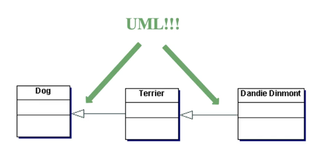

In this picture, we can see that the arrow shows the Inheritance relationship.

The error points from the derived class to the base class.

## Composition: Another form of Reuse
Composition is a form of reuse.

Steady of reusing capabilities by inheriting operations from a base class, we emded another class within the original class and delegate out to operations defined by the other class.

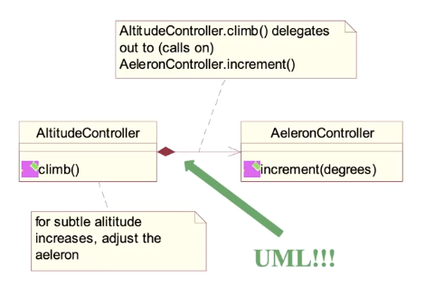

The UML for composition is a "colored diamond" of the composing class with a solid line with an optional arrow at the pointing towards the composed class.

In the example, when the `AttitudeController` wants to climb, it will call a method of the composed class `AeleronController` (in this case, `increment(degrees)`).

### Differences Between Inheritance and Composition.
The composing class may piblish in its public interface the composed classes interface, or it may not.

Composition DOES NOT imply a taxonomic relationship between classes.

For instance, `AttitudeController` is not a type of `AeleronController`.

What we have here is a class that uses the capabilities of another class.

### Dynamic Run-Time Binding
Composition is more flexible than inheritance because method implementations can be dyanmically selectable (determined) at runtime.

### Characteristics of Compositions
- Composition models is a "has-a relationship" vs. Inheritance is a "is-a relationship".
- Composition is a strengthened form of aggregation implying simultaneous lifetime.
- Strong Composition:
    - a part cannot belong to more than one whole (No my dear, that's my hand you are holding).
    - concurrent instantiation and destruction with whole.
    - examples:
        - a hand is only of one robot, not multiple robots
        - a delivery is only for one client, not multiple clients

### Why use Composition over Inheritance?
When we inherite something, the inheritance is accrued at compile time and it is fixed. When we inherit from a base class, the methods and attributes from that base class come automatically with the inheritance.

Composition allows us to just point-out to another object and get a completely different form of Encryption.

Therefore, composition allows us to swap implementation easily, whereas inheritance doesn't make that easy. Composition is designed for change: more flexibility in the long-term.

### Why Inheritance over Composition?
More easily can use methods and one more fixed structure.

## Static Class Relationships in UML
### Association Relationship
There is some relation between the classes.

This kind of relationship is generally draw with a solid line, usually with an arrow.


Inside association, we have two types:
- generic association
- aggregation (whole/part)

### Generalization Relationship
Specifies an inheritance of type relationship.

Specifies an "is-a" relationship among classes and/or interfaces.

The relationship is draw from the derived class to the base class.

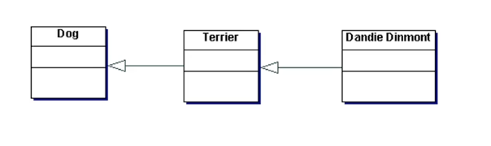

We can have single inheritance:

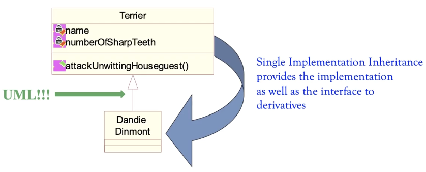

Or multiple inheritance:

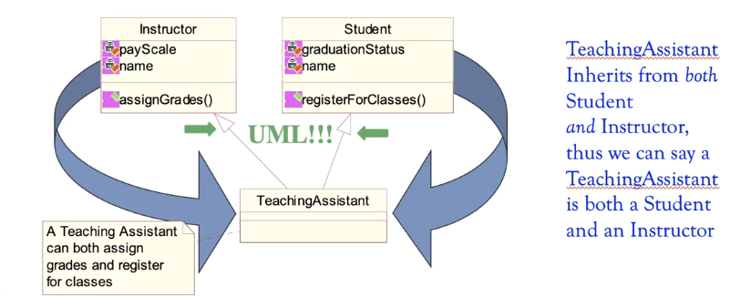

For multiple inheritance, we need to implement the UML in a language that allows for multiple inheritance.

For instance, Java only allows for a single inheritance.

### Realization Relationship
A relationzation relationship is draw with a dashed line.

For instance, in this example, the professor will implement the interface of instructor and the interface of employee.

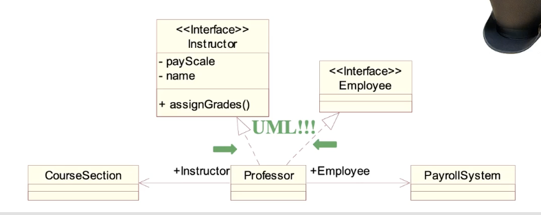

In this case, we are still declaring a taxonomical relationship between the classes/interfaces:
- A professor is an instructor and;
- A professor is an employee.

Both generalization and realization imply taxonomical relationship.

### Dependency Relationship
A dependency is a dashed line with an arrow pointing at dependent.

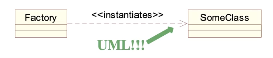

In this case, we are specifying that the factor class is dependent on the interface of another class.

This shows that, if the interface of this other class changes (not the implementation - the interface!!), Factory may be in trouble.

This kind of UML shows that there is a danger to make changes.

### Aggregation
Composition is a strong form of Aggregation.

Aggregation specifies a particular type of relationship, one where one class aggregates, or contains another.

Aggregation specifies a whole/part relationship and it is draw with an open diamond (not colored) and a solid line at the aggregate.

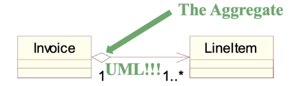

If the diamond is colored, it means we are dealing with composition.

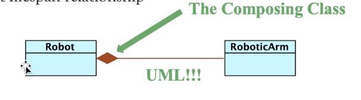

## Tools that can help us draw this
There are a variety of tools to do this.

- Visio
- DAI (on Linux)

We will use Visual Paradigm: how to produce an UML model. Visual Paradigm is very specific for UML and allow us to draw with more rigor.

Visual Paradigm is downloadable.

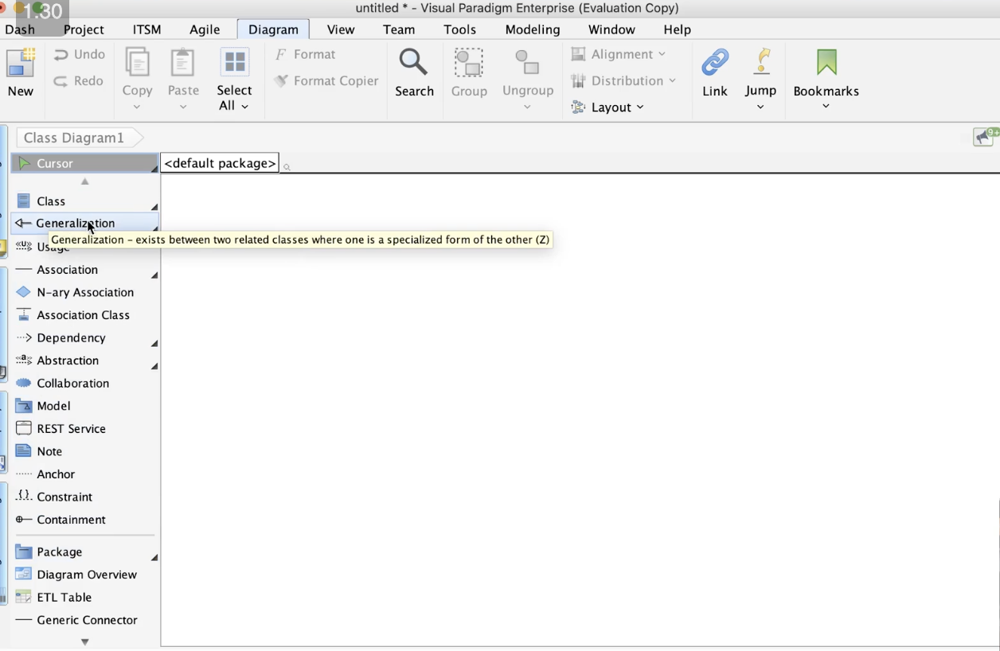

In the Visual Paradigm, we have multiple tools specific for UML drawing.

Generalization:

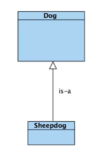

Composition Relationship: a sheepdog always has pelt

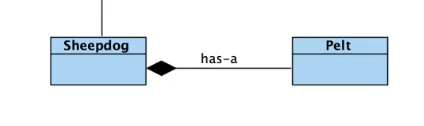

Aggregation Relationship: a sheepdog sometimes has a caninetooth

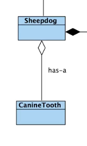