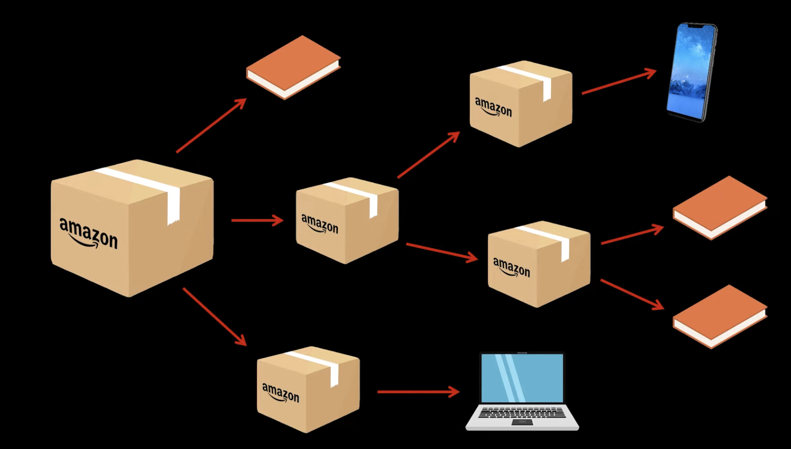
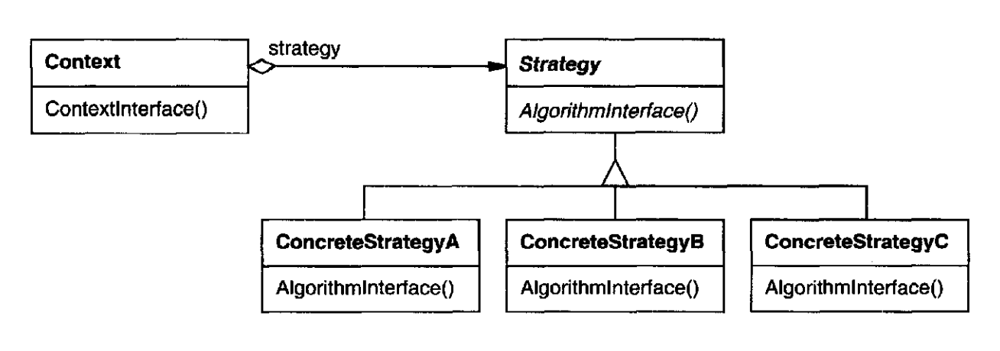
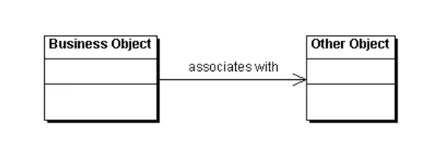

# OO Architecture Patterns
# Singleton
Ensures a class only has one instance, and provide a global point of access to it.

We use the Singleton pattern when there must be exactly one instance of a class, and it must be accessible to clients from a well-known access point.

It's important for some classes to have exactly one instance. 

In the general sense, a global variable makes an object accessible, but it doesn't keep you from instantiating multiple objects.

Benefits:
- Controlled access to sole instance.
- Reduced name space: it avoids polluting the name space with global variables that store sole instances.
- Permits refinement of operations and representation: Singleton may be subclassed, it is easy to configure an applicatino with an instance of this extended class.
- Permits a variable number of instances: the pattern makes it easy to change your mind and allow more than one instance of a Singleton. Only the operation that grants access to the Singleton instance needs to change.
- More Flexible than Class Operations: another way to package a singleton's functionality is to use class operations (like static member functions). Nonetheless, they are harder to change in case we want to modify the behaviour of a Singleton.

```java
class Singleton {
    // the constructor must be either private or protected
    protected Singleton() {}

    public static Singleton getInstance() {
        if (instance == null) {
            synchronized(Singleton.class) {
                if (instance == null) {
                    instance = new Singleton();
                }
            }
        }
        return instance;
    }

    private static Singleton instance;

    public void aMethod() {
        System.out.println("Inside Singleton::aMethod");
    }

}
```

```java
public class SingletonClient {
    public static void main(String[] args) {
        Singleton s1 = Singleton.getInstance();
        s1.aMethod();
        Singleton s2 = Singleton.getInstance();
        s2.aMethod();
        if (s1 == s2) {
            System.out.println("Correct: Both s1 and s2 are the same instance");
        } else {
            System.err.println("Error: s1 and s2 are different instances");
        }
    }
}
```

Synchronized thread management:
The `synchronized(Singleton.class)` allows us to avoid the possibility to have our thread stopped and started again and accidently instanciating two singletons.

## Government Example
Remember: provides a single point of access to it.

- There is only one government.


# Template Method
Define the skeleton of an algorithm in an operation, deferring some steps to subclasses. Template Method redefine certain steps of an algorithm without changing the algorithm's structure.

ConcreteClass makes reference to the AbstractClass.

- Abstract class defines abstract primitive operations that concrete subclasses define to implement steps of an algorithm. Implements the template.
- Abstract class can have "hook operations", which provide default behavior that subclasses can extend if necessary (by default, a hook operation generally does nothing).
- Concrete class implements the primitive operations to carry out subclass-specific stepsof the algorithm.

Should be used to:
- implement the invariant parts of an algorithm once and leave it up to subclasses to implement the behavior that can vary.
- when common behavior among subclasses should be factored and localized in a common class to avoid code duplication (identify differences in existing code and then separate the differences into new operations - finally, replace the differing code with a template method that calls one of these new).

The `InsurancePolicy`:
```java
package templatemethod;

abstract public class InsurancePolicy {
    public void setup() {
        System.out.println("Inside InsurancePolicy::setup");
        tempVar = 0.0;
        premium = 0.0;
    }

    public void printPremium() {
        System.out.println("Inside InsurancePolicy::printPremium");
    }

    public void pricePolicy() {
        setup();
        stageOne();
        stageTwo();
        printPremium();
    }

    abstract public void stageOne();
    abstract public void stageTwo();

    protected double tempVar;
    protected int AccountNumber;
    protected double premium;
}
```

Now, from `InsurancePolicy` we derive:

```javamust
package templatemethod;

public class CommercialAutoPolicy extends InsurancePolicy {
    public void stageOne() {
        System.out.println("Inside CommercialAutoPolicy::stageOne");
        tempVar = 100.0;
    }

    public void stageTwo() {
        System.out.println("Inside CommercialAutoPolicy::stageTwo");
        premiummust = tempVar * 2;
    }
}
```

```java
package templatemethod;

public class BusinessOwnersPolicy extends InsurancePolicy {
    public void stageOne() {
        System.out.println("Inside BusinessOwnersPolicy::stageOne");
        tempVar = 81082;
    }

    public void stageTwo() {
        System.out.println("Inside BusinessOwnersPolicy::stageTwo");
        premium = tempVar * 3;
    }
}
```

# Composite
Compose objects into tree structures to represent part-whole hierarchies.

Composite lets clients treat individual objects and compositions of objects uniformly.

Composite is a way to group components to form larger components, which in turn can be grouped to form still larger componets.

For instance: graphical primitives. The graphical primitive has `Line`, `Rectangle`, `Text` and `Picture` related to it inside the same bigger component.

The code MUST treat primitive and container objects differently, even if most of the time the user treats them identically.

## Inside the Composite
The pattern has an abstract class that represents both primitives and their containers. This class in the example is `Graphic`: it declares operatins that the other classes have as well.


In this case, the class `Picture` defines an aggregate of Graphic objects. The `Picture` interface conforms to the `Graphic` interface, `Picture` objects can compose other `Picture` objects recursively.


Advantages:
- Helps to represent a part-whole hierarchy of objects.
- Clients will treat all objects in the composite structure uniformly.

## Amazon Boxes Example
Imagine we run amazon delivery system and we have products and boxes.

A box can contain other products as well as smaller boxes.



What can we do to calculate the total price of the delivery?

We could unwrap all the boxes and calculate the total price in this sense.

Nonetheless, having this stored inside a class with multiple arrays can be a challeging.

Example of a bad solution:


The Composite Design Pattern allow us to compose objects into tree structures and then work with these structures as if they were individual objects.

```java
package composite;

import java.util.ArrayList;
import java.util.Arrays;
import java.util.List;

public class CompositeBox implements Box {
    private final List<Box> children = new ArrayList<>();
    
    public CompositeBox(Box... boxes) {
        children.addAll(Arrays.asList(boxes));
    }

    @Override
    public double calculatePrice() {
        return children.stream().mapToDouble(Box::calculatePrice).sum();
    }
}
```

```java
package composite;

public interface Box {
    double calculatePrice();
}

```

The composite class `CompositeBox` is only used to store multiple other boxes.
The fact that the `CompositeBox implements Box` is saying that the previous agrees to follow the contract defined by `Box`: in other words, it aggrees to follow all methods declared in `Box`.

The `CompositeBox` is a composite component in the composite design pattern structure. Therefore, `CompositeBox` can contain multiple `Box`'s, while the other elements like `Product`, `Book` and `VideoGame` cannot do that.

The `Box... boxes` allows us to pass an arbitrary number of elements inside the `CompositeBox` in its constructor.

We can pass `Product` inside the `CompositeBox` because the `Product` implements the `Box` interface as well.

- The `Box` interface represents and describes operations that are common to both the simple and complex elements of the tree.
- The Leaf are basic elements that do not have subelements.
- The Composite has subelements but does not know the concrete classes of its children: they just have to implement the interface.

The client works with all the elements, and does not see a difference between the `Composite` and the `Leaf`.


By making use of this type, we can introduce the Open-Closed principle: we can introduce new element types into the application without breaking the existing code.

# Iterator (Cursor)
Provides a way to access the elements of an aggregate object sequentially without exposing its underlying representation.

A aggregate object such as a list should give you a way to access its elements without exposing its internal structure.

The key idea of this pattern is to take the responsibility for access and traversal out the list object and put it into an iterator.


Once we have the `ListIterator` we can access the list's elements sequentially.
- `CurrentItem` operation returns the current element in the list.
- `First` initializes the current element to the first element.
- `Next` advances the current element to the next element.
- `IsDone` checks if we have advanced beyond the last element.

Allows us to not show the specific implementation of graph (or list) and get the elements of it.
Furthermore, it encapsulates all of the traversal details.

Because of the iterators behavior, several iterators can go through the same collection at the same time.

## Trip Example


For instance, we can the following two types of Iterators which gives us ways to go through data:

```java
package iterator;

public class BreadthFirstIterator<T> implements Iterator<T> {

    public BreadthFirstIterator() {
        // ...
    }

    @Override
    public boolean hasNext() {
        // ...
    }

    @Override
    public Vertex<T> getNext() {
        // ...
    }

    @Override
    public void reset() {
        // ...
    }
}
```

```java
package iterator;

import java.util.Deque;
import java.util.LinkedList;

public class DepthFirstIterator<T> implements Iterator<T> {
    private final Vertex<T> startVertex;
    private Deque<Vertex<T>> stack = new LinkedList<>();

    public DepthFirstIterator(Vertex<T> startVertex) {
        this.startVertex = startVertex;
        stack.push(startVertex);
    }

    @Override
    public boolean hasNext() {
        return !stack.isEmpty();
    }

    @Override
    public Vertex<T> getNext() {
        if (!hasNext()) {
            return null;
        }
        Vertex<T> current = stack.pop();
        if (!current.isVisited()) {
            current.setVisited(true);
            current.getNeighbors().forEach(stack::push);
            return current;
        }
        return getNext();
    }

    @Override
    public void reset() {
        stack.clear();
        stack.push(startVertex);
    }
}package iterator;

public interface Iterator<T> {
    boolean hasNext();
    Vertex<T> getNext();
    void reset();
}

Both implement the interface `Iterator`.

```java
package iterator;

public interface Iterator<T> {
    boolean hasNext();
    Vertex<T> getNext();
    void reset();
}
```

In conclusion the Iterator pattern:
- traverses the elements of a collection without exposing its underlying representation.
- encapsulates the details of complex data structures by exposing simple methods to access the collection elements.

# Strategy
Define a family of algorithms, encapsulate each one, and make them interchangeable. Strategy lets the algorithm vary independently from clients that use it.

Uses a class to encapsulate different line-breaking algorithms. The algorithm that is encapsulated in this way is called strategy.


A composition class is responsible for maintaining and updating the linebreak of text displayed in a text viewer.

The linebreak is not implemented inside the class Composition, but in the subclasses of the class `Composition`.

- The Strategy class is specially useful when the classes differ only in their behaviour, while the structure remains the same.
- The algorithm uses data that the client should not know about. It uses the Strategy pattern to avoid exposing complex, algorithm-specific data structures.

The overall structure:



The context defines an interface that lets Strategy access its data.


# Enterprise Integration Patterns
Good systems rely on integration. Integration solutios have soome fundamental challenges:
- networks are unreliable
- networks are slow
- any two applications are different
- change is inevitable

Those issues are solved with:
- file transfer: one application writes a fiel that another one reads.
- shared database: multiple applications share the same database schema.
- remove procedure invocation: one application exposes some of its functionalities so that  it can be accessed remotely by other applications as a remote procedure (real time and synchronous communication).
- messaging: one application publishes a message to a common message channel (the applications must agree on a channel as well as on the format of the message - happens asynchronously).

## Messaging
Messaging is like a voice-mail, but not like a call, because it is asyncronous.

Messaging is a technology that enables high-speed, asynchronous, program-to-program communication with reliable delivery.

- Messages: packet of data that is sent from one program to another.
- Channels: also known as queues. Are logical pathways that connect the programs and convey messages. Behaves like a collection or array of messages.
- Sender/Producer: a program that sends a message by writing a message to a channel.
- Receiver/Consumer: program that receives a message by reading (and deleting) it from a channel.

A message is simply some sort of data structure (string, array, record, object).
It can be interpreted as a data or as a description of commands to be invoked on the receiver.

Message contains:
- header: with meta-information about the message (who sent it, when, where it is going, etc...)
- body: contains the application data being transmitted and is usually ignored by messaging system.

## Messaging System
Messaging capabilies are typically provided by a separate software system: Messaging System or Message-Oriented Middleware (MOM).

It manages messaging the way a database system manages data persistence.

A admistrator must configure the messaging system with channels that define the paths of communications.

The main task of the messaging system is to move messages from the sender to the receiver.

Not always applications are ready to receive or send information.

A messaging system overcomes this limitation by repeatedly trying to transmit the message until it succeds.

A message is transmitted in five steps:
1. create: the sender creates the message.
2. send: the sender adds the mesage to a channel.
3. deliver: the messaging system moves the message from the sender's computer to the receiver's computer, making it available to the receiver.
4. receive: the receiver reads the message from the channel
5. process: the receivr extracts thhe data from the message.


By wrapping the data as a message and storing it in the messaging system, the applications delegate to the messaging system the responsibility of delivering the data. Because the data is wrapped as an atomic message, delivery can be retried until it succeeds, and the receiver can be assured of reliably receiving exactly one copy of the data.

It allows for:
- Remote communication: messaging enables separate applications to communicate and transfer data.
- Platform/Language integration: different systems use different languages, technologies and platforms. A messaging system can be an universal translator between the applications.
- Asynchronous communication: allows for send-and-forge approach to communication.
- Variable timing: in synchronous communication, the caller can make calls only as fast as the receiver can perform them. Asynchronous communication allows the sender to submit requests to thee receiver at its own pace and the receiver to consume the request at a difference pace.
- Throttling: A problem with remote procedure calls (RPCs) is that too many of them on a single receiver aat the same time can overload the receiver. In message queues, the request is still there until the receiver is read to process them.
- Reliable communication: provides a store-and-forward approach.
- Disconnected Operations: some applications are specifically designed to run disconnected from the network. Messaging allows than to synchronize with the servers when a network connection is available.
- Mediation: if an application becomes disconnected from the others, it needs only to reconnect to the messaging system to receive the messages that were sent while it was disconnected.
- Thread Management: means that one application does not have to block while waiting for another application to process a request.

## Thinking Asynchronously
RPC (such as CORBA and DCOM) use synchronous communication. The caller waits for the receiver to process the request.


We do not have one thread of execution anymore, we have multiple threads of execution.
Concurrent threads make debugging more difficult.

Results arrive via a callback mechanism: the caller has to be able to process the result even while it is in the middle of other tasks.

## Distributed Applications versus Integration
Distributed applications are applications that are distributed across multiple computers.

Integrated applications are independent applications that can each run by themselves but that coordinate with each other in a loosely coupled way.

This enables each application to focus on one comprehensive set of functionalities and yet delegate to other applications for related functionalities.

## Commercial Messaging Systems
We can group the messaging vendor's products into four categories:
- operating systems
- applications servers (e.g. Java Messaging Service - JMS)
- EAI suites
- Web Services Toolkits

The main enterprise integration patterns are:
- message channel
- point-to-point channel
- publish-subscribe channel
- message
- message endpoint

Each messaging system will call those in a different way.


## Pattern Form
Each pattern follows this structure:
- name
- icon: most patterns are associated with an icon in addition to the pattern name
- context: explains that type of work might make you run into the problem that this pattern solves
- problem: explains the difficulty you are facing expressed as a question. you should be able to read the problem statement and quickly determine if this pattern is relevant to your work
- forces: explore the constraints that make the problem difficult to solve
- solution
- sketch
- result: expands of the solution
- next: lists other patterns to be considered after applying the current one
- sidebars: discuss more detailed technical issues or variations of the pattern
- examples

## Diagram Notation
The Unified Modeling Language (UML) does a fine job of describing object-oriented systems with class and interaction diagrams.
But it does not contain semantics for messaging systems.

UML Profile for Enterprise Application Integration (UMLEAI) is a set of UML extensions that provide a way to model messaging systems.

The book does not use UMLEAI, but instead uses a simpler notation that is easier to understand:


The message is represented with a small tree with a round root and nested, square elements. Many messaging systems allow messages to contain tree-like data structures (for example, XML documents).

# Chapter 3: Messaging Systems
## Introduction
Messaging makes the communication more reliable because the applications do not need to be running at the same time.

Messaging makes the messaging system responsible for delivering the message so the applications only need to worry about on what data they need to share.

Channels: logical pathways that connect the programs and convey messages.
Messages: packets of data that are sent from one program to another.
Multi-step delivery: message might need to be validated or transformed before being delivered to the receiver. Pipes and Filter architecture describes how multiple processing steps can be chained together using channels.
Routing: a message may have to go through several channels to reach the final destination. With the routing, the original sender sends the message to a message router and the filters and pipes architectures will ensure that the delivery is made properly.
Transformation: a sender might send the message in one way and the receiver might need it in another way. The transformation is the process of converting the message from one format to another. For that, we use the Message Translator pattern.
Endpoint: An application does not have some built-in capabilities to interface with a messaging system. It must contain a layer of code that knows both how the application works and how the messaging system works, bridging the two so that they work together. THe bridge code is a set of coordinated Message Endpoints.

## Message Channel


The message channel is a pipe that connects the sender to the receiver. The sender writes a message to the channel and the receiver reads the message from the channel.

When an application has information to communicate, it doesn't just fling the information into the messaging system, it adds the information to a particular Message Channel.

The messaging system has different Messages Channels for different types of information.

The particular implementation of the Message Channel depends on the messaging system (which commercial messaging syste is being used).

There are two different types of Message Channels:
- Point-to-Point Channel: the message is sent to one receiver. The message is removed from the channel once it is read.
- Publish-Subscribe Channel: the message is sent to multiple receivers. The message is copied and sent to each receiver.

## Message
The message is a packet of data that is sent from one program to another.
The data is usually transmitted as a byte stream.

A message consists of two parts:
- header: contains meta-information about the message (who sent it, when, where it is going, etc...)
- body: contains the application data being transmitted and is usually ignored by the messaging system.

## Pipes and Filters
In many enterprise integration scenarios, a singl event triggers a sequence of processing steps, each performing a specific function.
Let's say for instance that we have a delivery system. The delivery system receives an order and then has to (i) check if the message is encrypted, (ii) check with customer's if possible duplicated shipments are failures of the system
The Pipes and Filters architecture describes how multiple processing steps can be chained together using channels.

One bad solution for it would be to implement all the "checking" functions inside a single component.
Creating smaller, well-defined components allow us to reuse them in other processes.

Integration solutions are typically a collection of heterogeneous systems.
As a result, different processing steps may need to execute on different physical machines. For instance, the decryption of the message can only be done in one machine or different processing steps may only be implemented using different programming languages or technologies.

Implementing each function in a separate component can still introduce dependencies between the components. We can have that the decryption component calls the authentication component with the result of the decryption. On the other hand, we should also try to take advantage of the asynchronous nature of messaging systems.
Using asynchronous messaging, multiple messages can be processed concurrently, and the processing steps can be distributed across multiple machines.


The idea is to have all the components having the same external interface: they can be composed into different solutions by connecting the components to different pipes.
We can add new filters, omit existing ones or rearrange them into a new sequence - all without changing the filters themselvees.

The pipe connects one filter to the next, sending output messages from one filter to the next.

The connection between filter and pipe is sometimes called port.

Pipes are also used to get the message from the sender and send the message to the receiver.
Therefore, in our example above, we have 4 pipes and 3 filters.

In a general way, we want to implement the components in a way that they communicate with an abstract pipe interface.

### Downside of Pipes and Filters
One of the potential downsides of Pipes and Filters architecture is the larger number of required channels.

Channels provide buffering ad other functions that consume memory and CPU cycles.

### Upside of Pipes and Filters
Improves testability: we can test each individual processing step by passing a Test Message to the component and comparing the result to the expected outcome.

It is more efficient to test and debug each core function in isolation because we can tailor the test mechanism to the specific function.

### Pure Implementation
The pure implementation of Pipes and Filters allows each filter to ahve only a single input port and a single output port.

When dealing with a more practical approach, Message Router might be more efficient: a component may consume messages off more than one channel and also output messages to more than one channel.

### Processing
Connecting components with asynchronous message channels allows each unit in the chain to operate in its own thread or its own process.

When a unit has completed processing one message it can send the message to the output channel and immediately start processing another message:


### Parallel Processing
However, the overall system throughput is limited by the slowest filter in the chain.

To improve the throughput, we can use parallel processing: deploy multiple parallel instances of that process throughput.

In this scenario, a Point-to-Point Channel with Competing Consumers is needed to guarantee that each message on the channel is consumed by exactly one of the parallel instances.


This case is specifically useful when decrypting takes a longer time than the other filters. 

This configuration can cause messages to be processed out of order. If the sequence of messages is critical, we can only run one instance of each component or use a Resequencer.

# Message Router
Multiple processing steps in a Pipes and Filter chain are connected by Message Channels.

The message routers allows us to decouple individual processing steps so that the messages can be passed to different filters depending on a set of conditions.

The Pipes and Filters architectural style connects filters directly to one another with fixed pipes.
Nonetheless, message-based integration solutions, on the other hand, deals with individual messages which are not necessarily associated with a single, larger dataset.
Therefore, individual messages are more likely to require a different series of processing steps, which do not work well with the fixed pipes.

By default, the message channels has a very simple routing mechanism: the message is sent to a single receiver.
Some message systems allow components to check the message without removing them from the queue to determine if they should process it.
Nonetheless, this is not an optimal solution, since it takes time to components to check the message and maybe not do anything with it.

A message router consumes a message from one message channel and republishes it to a different message channel depending on the set of conditions.


A message router differs from the most basic notion of Pipes and Filters in that it connects to multiple output channels.

Thanks to the Pipes and Filters architecture the components surrounding the message router do not need to know about the router itself.

The KEY PROPERTY of the message router is that it does not modify the message itself, it only changes the channel to which the message is sent.

The key benefit of using a message router is that the decision criteria for the destination of a message are maintained in a single location. If new message types are defined, new processing components are added or routing rules change, we only need to change the message router.

The message router has to have knowledge of all possible message destinations in order to send the message to the correct channel.
If the list of possible destinations change frequently, the message router maintenance can become a burden. In these situations, using a Publish-Subscribe Channel might be a better solution or an array of Message Filters.

## Disadvantages
- A message router can degrade the performance, specially because it might need to decode the message from one channel before it can place it in another channel.
- A message router allows for loose coupling. Nonetheless, if there is too much loose coupling, the overall system becomes hard to understand as well as the messages flow.

One way to avoid the confunsion in Message Routes is with the Message History: it inspect messages at runtime and see which components they transverse.
Many EAI packages maintain channel subscriptions in a central repository, making this type of static analysis easier.

## Variants
- fixed router: only one input channel and a single output channel are defined (generally combined with a Message Translator or a Channel Adapter).
- context-based router: decide the message's destination based on the environment condition. Those routers are commonly used to perform load balancing, test or failover functionalities (e.g. see which processor would be better in this moment).

## Stateless vs Stateful
- Stateless: the router makes the decision based on the message content.
- Stateful: the router makes the decision based on the message history (the router keeps might eliminate duplicate messages by keeping a list of all messages already received).

Most routers contain hard-coded logic for the routing decision. Some routers connect to a Control Bus: middleware solution that changes the decision criteria without having to make any code changes or interrupting the flow of messages.

# Message Translator
Each application is usually built around a proprietary data model: for instance, the account system may be more interested in the customer's tax payer ID and the customer-relationship management might be more interested in the address and cellphone.

Integration solutions often times interact with standardized data formats that seek to be independent of their application (e.g. XML, JSON).

In many cases, the integration solution needs to be able to communicate with external parties using the "official" data formats, while the internal systems are based on proprietary format.

We could avoid having to transform messages if we could modify the applications to use a common dat format, nonetheless, this is generally harder to do (might require a lot of changes to inherent business functionalities). Furthermore, adjust the applications makes them more tightly connectected.
This goes against the key architectural principle of loose coupling between applications: it would make two applications direclty dependent of each other's internal representation, which eliminates the possibility of replacing or changing one application without affecting the other application.


The translation might have to be done in different levels:
- data structure: entities, associations, cardinality, etc... also referred as the application layer
- data types: field names, data types, etc...
- data representation: also refereed as the sintax layer (XML, name-value, encryption/compression)
- transport: communication protocols (TCP/IP sockets, HTTP, JMS, etc...)

We can view each of these as a layer of transformation.

The Message Translator is a component that translates the data from the internal representation to the external representation and vice-versa.

## Chaining Transformations
Many business scenarios require transformations at more than one layer.
The beauty of a layered model is that we can treat one layer without regard to the lower layers and, therefore, can choose to work at different levels of abstraction.

In the end, we use the idea of Pipes and Filters to chain the transformations together.


Creating a message translator for each layer allows us to reuse there components in other solutions.

For instance, the Channel Adapter and the EDI-to-XML Translator can be reused in other solutions:


# Levels of Decoupling
1. Message Channels: decouple applications from having to know each other's locations.
2. Message Router: decouple applications from having to agree on a common Message Router (or path).
3. Message Translator: decouple applications from having to agree on a common data format.

# Message Endpoints
How does an application connects to a messaging channel to send and receive messages?

The applications and the messaging syste are two separate set of software.

The application provides functionalities for some type of user, whereas the messaging system manages messaging channels for transmitting messages for communication.

A message system is a type of server, capable of taking requests and responding to them.
Like a database accepting and retrieving data, a messaaging server accepts and delivers messages.

A messaging system is a messaging server and its clients are the applications that send and receive messages.

A messaging server, like a database server, has a client API that the application ca sue to interact with the server. The API is not applications-specific, it is a general-purpose API that can be used by any application.

This is a message endpoint: it is custom to both the application ad the messaging system's client API.

A Message Endpoint should be designed as a Message Gateway to encapsulate the messaging code and hide the message system from the rest of the application.
It can employ a Messaging Mapper to transfer data between domain objects and messages.

## Specifications
- One message endpoint can either send or receive messages, but NOT both.
- An endpoint is channel-specific: it is connected to a single channel.
- A single application would use multiple endpoints to interface with multiple channels.


# Intro to UML - Lecture Recording
UML is Unified Modeling Language. It has been around for 25 years.

First, we will take a look at the Static Model, than at the Dynamic Model.

Today, from building the UML, some tools allow us to automatically generate code based on it.
We can also reverse engineer existing code into the model.

## Bounded Contexts
Is a combination of a focus of highly cohesive concepts within a sub domain along with the data that is relevant for that particular domain.

Multiple bounded contexts interacte with one another in a larger system.

For instance, if you are building a system for an airline, you can have multiple bounded contexts. Those can be:
- flights
- schedules
- reservations
- customers points
- billings

Bounded contexts provide good modeling framework to design microservices.

They are useful in designing any form of system.

### Law of Demeter
The Law of Demeter for the bounded contexts says that we are suppose to stay within the context.
We are not supposed to reach out of the contexts into the internals of some other context.

From one contexts, we can reach out to another context to get information through an API. From one context, we are not suppose to reach in and manually manipulate another context.

### What language can we use to produce this domain model?
What language can we use to design that? The prefered language to do that is the UML language!

## Domain Models and UML
UML has a strong relation with object oriented paradigm.

The OO not necessary for UML, but generally used. In languages where the OO paradigm does not exist, UML can still work using different tools.

Nonetheless, we will consider that we are working with OO.

## Inheritance
### Revision
Inheritance supports two fundamental but related functions:
- allowing one class to automatically reuse the interface/implementations of another.
- allowing for the substitutability of one related object for another (Liskov Substitution Principle and polymorphism).

### Taxonomic Inheritance
Inheritance implements an "is-a" or "is a type of" relationship.
- a man/woman is an animal.
- a driver's license is a type of official document.

### Inheritance Issues
Different languages support different kinds of Inheritance.

Languages that support inheritance only from one superclass:
- Simula
- Java
- Smalltalk

Languages that support inheritance from multiple superclasses:
- C++
- Python
- Java (interface only)

UML supports both single and multiple.

### Generalization of Inheritance Relationship in UML
The UML has three compartments:

| Name of the Class                                   |
|-----------------------------------------------------|
| Attributes of the Class                             |
| Methods/Operations of the Class (with parameters)   |


In this picture, we can see that the arrow shows the Inheritance relationship.

The error points from the derived class to the base class.

## Composition: Another form of Reuse
Composition is a form of reuse.

Steady of reusing capabilities by inheriting operations from a base class, we emded another class within the original class and delegate out to operations defined by the other class.


The UML for composition is a "colored diamond" of the composing class with a solid line with an optional arrow at the pointing towards the composed class.

In the example, when the `AttitudeController` wants to climb, it will call a method of the composed class `AeleronController` (in this case, `increment(degrees)`).

### Differences Between Inheritance and Composition.
The composing class may piblish in its public interface the composed classes interface, or it may not.

Composition DOES NOT imply a taxonomic relationship between classes.

For instance, `AttitudeController` is not a type of `AeleronController`.

What we have here is a class that uses the capabilities of another class.

### Dynamic Run-Time Binding
Composition is more flexible than inheritance because method implementations can be dyanmically selectable (determined) at runtime.

### Characteristics of Compositions
- Composition models is a "has-a relationship" vs. Inheritance is a "is-a relationship".
- Composition is a strengthened form of aggregation implying simultaneous lifetime.
- Strong Composition:
    - a part cannot belong to more than one whole (No my dear, that's my hand you are holding).
    - concurrent instantiation and destruction with whole.
    - examples:
        - a hand is only of one robot, not multiple robots
        - a delivery is only for one client, not multiple clients

### Why use Composition over Inheritance?
When we inherite something, the inheritance is accrued at compile time and it is fixed. When we inherit from a base class, the methods and attributes from that base class come automatically with the inheritance.

Composition allows us to just point-out to another object and get a completely different form of Encryption.

Therefore, composition allows us to swap implementation easily, whereas inheritance doesn't make that easy. Composition is designed for change: more flexibility in the long-term.

### Why Inheritance over Composition?
More easily can use methods and one more fixed structure.

## Static Class Relationships in UML
### Association Relationship
There is some relation between the classes.

This kind of relationship is generally draw with a solid line, usually with an arrow.



Inside association, we have two types:
- generic association
- aggregation (whole/part)

### Generalization Relationship
Specifies an inheritance of type relationship.

Specifies an "is-a" relationship among classes and/or interfaces.

The relationship is draw from the derived class to the base class.


We can have single inheritance:


Or multiple inheritance:


For multiple inheritance, we need to implement the UML in a language that allows for multiple inheritance.

For instance, Java only allows for a single inheritance.

### Realization Relationship
A relationzation relationship is draw with a dashed line.

For instance, in this example, the professor will implement the interface of instructor and the interface of employee.


In this case, we are still declaring a taxonomical relationship between the classes/interfaces:
- A professor is an instructor and;
- A professor is an employee.

Both generalization and realization imply taxonomical relationship.

### Dependency Relationship
A dependency is a dashed line with an arrow pointing at dependent.


In this case, we are specifying that the factor class is dependent on the interface of another class.

This shows that, if the interface of this other class changes (not the implementation - the interface!!), Factory may be in trouble.

This kind of UML shows that there is a danger to make changes.

### Aggregation
Composition is a strong form of Aggregation.

Aggregation specifies a particular type of relationship, one where one class aggregates, or contains another.

Aggregation specifies a whole/part relationship and it is draw with an open diamond (not colored) and a solid line at the aggregate.


If the diamond is colored, it means we are dealing with composition.


## Tools that can help us draw this
There are a variety of tools to do this.

- Visio
- DAI (on Linux)

We will use Visual Paradigm: how to produce an UML model. Visual Paradigm is very specific for UML and allow us to draw with more rigor.

Visual Paradigm is downloadable.


In the Visual Paradigm, we have multiple tools specific for UML drawing.

Generalization:


Composition Relationship: a sheepdog always has pelt


Aggregation Relationship: a sheepdog sometimes has a caninetooth (not always)


Dependency: the dog uses the `BarkingMechanism` to bark. More specifically, we specify it with a dependency and add the publi method `bark`. We specify that the method is public by using the `+` sign.


Realization: now, lets say that we also have the `Pet` class. We can say that not every dog is a pet (some dogs are not pets).


The overall drawing:


Finally, we can generate code from there:


The hability to generate code from UML is for Java and C++. It is specially useful and more straight forward for Java.

### Excalidraw
Allows multiple people to collaborate in the same drawing.

# Advanced Static Modeling in UML - Lecture Recording
We start by mentioning an example `UniversityAfilliatedPerson`.
The `UniversityAfilliatedPerson` is a `Instructor` and `Student`.

What we are doing here is not inherit the implementation, but only the interface!!


In this case, what we have done is included `InstructorImpl`, `SerializationImpl`, `StudentImpl` with 
composition.

The composition and realization combined allow us to make something more dynamic than with Inheritance.

## Advanced Relationships
### Multiplicity Specification
With UML we can make associations that have to happen with a particular range of connections. A clear example for that is a `CourseSection` which must have between 5 and 25 students.


### Visibility
Class Operations and Attributes may be designated as public (+), private (-), or protected (#).

Associations may also be designated as private if they have the (-)


We can specify that we can access the password with the access token.

### Qualification
A qualifier is an attribute of an association which identifies the access path from the source object to the target object across the association.

For instance, an `Author` can be associated with the `Book` via an `ISBNumber`.


### Roles
A Class may play multiple roles in multiple associations.

We can say that a particular class can play one role when interacting with one class and another role when interacting with another class.

For instance, the `Professor` plays the role of `Instructor` when dealing with the `CourseSection` and the role of `Employee` when dealing with the `PayrollSystem`.


### Association
We can create a class that is an association between two other classes.

An Association Class encapsilates the manner in which the two classes are related.

For instance, the `Contract` is responsible for defining the relationship between the `Consultant` and the `Client`.


## Common Mechanisms
### Stereotypes
A stereotype allow us to extend the vocabulary of the UML.
- They are represented inside: `<<>>`
- Allow us to identify types of things inside the UML.

Some of the examples of stereotypes are:
- `<<exception>>`
- `<<interface>>`: is abstract and cannot be instanciated.
- `<<metaclass>>`
- `<<rule>>`: we can encapsulate a rule inside a class.
- `<<Singleton>>`: we can identify patterns inside the Stereotypes. We can indicate that the class is a Singleton or a Template Method.


### Tagged Values
Allow us to specify a bit of information about properties in UML.

They are enclosed within `{braces}` in UML: `{}`

They constitute metadata surrounding a particular element. We can specify some information about the class, like:
- `{numberOfProcessors=4}`
- `{tierLevel=middle}`
- `{implementationLanguage=C++}`: useful if we are writing most of our code in our language but this should be written in another language.

## Constraints
Constraints allow us to specify rules associated with relationships among classes.

They are enclosed within `{braces}` in UML as well: `{}`

They specify the rules for which the implementation myst abide.

Examples:
- `{secureConnectionRequired}`
- `{millisecondAccess}`
- `{redundant}`

Who ever will write the code for this part of the design has to abide by this rules.

## Notes
Notes allows us to add comments about any other object in an UML diagram.